# Multiple Linear Regression Using Python: Machine Learning

Here we can learn how to build a multiple linear regression model in machine learning using Visual Studio Code.

If we have more than one independent variables then instead of using simple linear regrassion we use multiple linear regression model.

The line equation for multiple linear regression model is:

$$
y = \beta_0 + \beta_1X_1 + \beta_2X_2 + \beta_3X_3 \; \dotsc \: \dotsc + \beta_iX_i + e  
$$

The dataset contains information about the 50 startups. Features include R&D Spend, Administration, Marketing Spend, State and Profit.

## Let's start by importing some libraries

```
import pandas as pd
import numpy as np
import matplotlib.pyplot as plt
import seaborn as sns
```

## Import dataset

Import the dataset and view it's first five columns. dot head() will show first five rows of dataset.

```
data_set = pd.read_csv('compList.csv')

data_set.head()
```

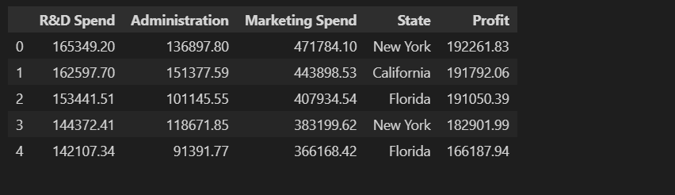

View the info of our dataframe, it shows that all the columns are numerical except State column. State has categorical values

```
data_set.info()
```

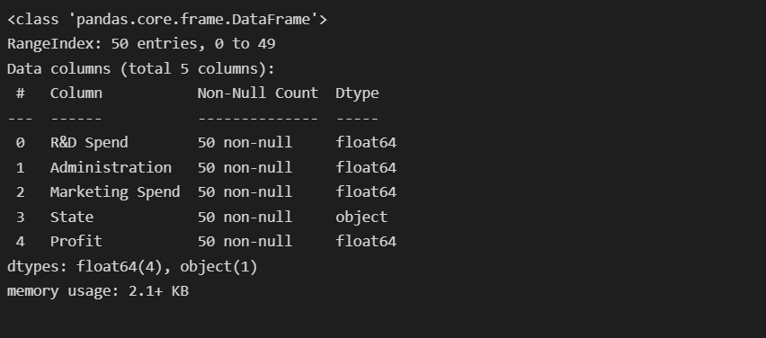

View the shape of the dataset.

```shape = data_set.shape
print("Dataset contains {} rows and {} columns".format(shape[0],shape[1]))
```

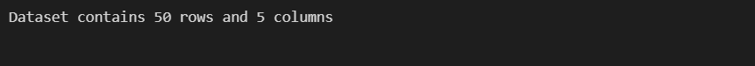

View all the columns in dataset.

```
data_set.columns
```

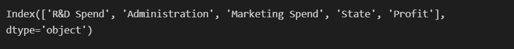

View all the unique values in column "State".

```
data_set['State'].unique()
```

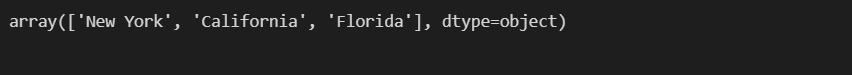

## Statistical Details of the dataset

```
data_set.describe()
```

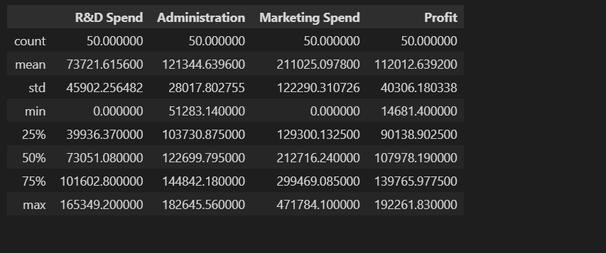

## Now we will define the Descriptive Features and Target Features Separately

### Extract Descriptive Features from dataset

```
X = data_set.iloc[:,:-1]
X.head()
```

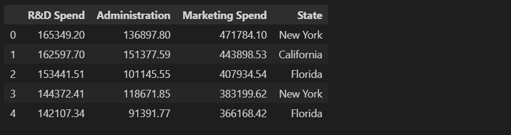

### Extract Target Features from dataset

```
y = data_set.iloc[:,-1:]
y.head()
```

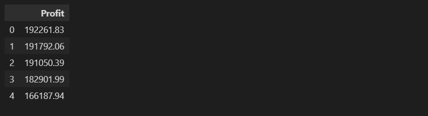

# Perform One-Hot Encoding

We will use One-Hot Encoding because we have categorical values in the dataset. If we look at the "State" column we have catagorical values in it. So we have to use One-Hot Encoding to convert them into binary combinations for further analysis.

```
# Using OneHoteEncoder

from sklearn.preprocessing import OneHotEncoder
one_hot_encoder = OneHotEncoder(handle_unknown='ignore')

X_encoder = pd.DataFrame(one_hot_encoder.fit_transform(X[['State']]).toarray())

X_encoder.head()
```

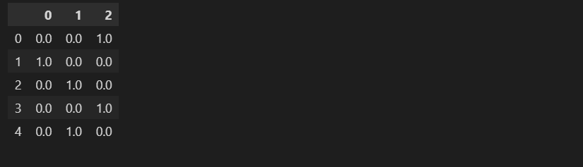

## Now join X_encoder with the Descriptive Features (X).

```
final_X = X.join(X_encoder)

final_X.head()
```
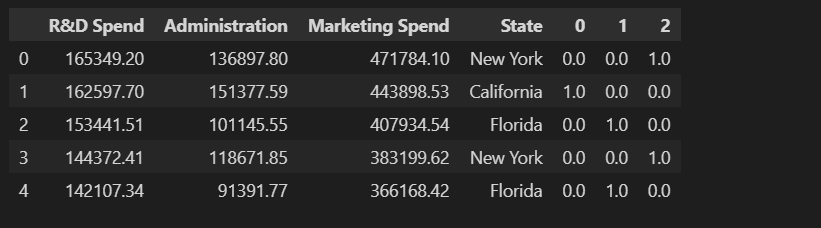

## Drop the original categorical variable (State)

```
final_X.drop('State', axis=1, inplace=True)

final_X.head()
```
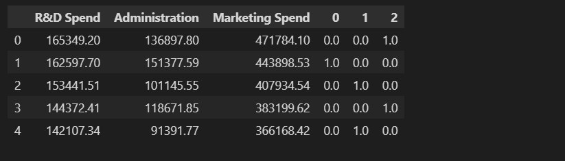


# Splitting the Dataset into Training Set and Test Set

Now split the dataset into two parts i.e., 80% data will go for training set and 20% dataset will go for test set. You can also choose 70-80, 60-40 or 50-50 training and testing set or according to your choice.

```
# Splitting the dataset into training set and test set

from sklearn.model_selection import train_test_split

X_train, X_test, y_train, y_test = train_test_split(final_X, y, test_size=0.2, random_state=0)
```

# Fitting the Multiple Linear Regression model to the training set

```
#Fitting the Multiple Linear Regression model to the training set

from sklearn.linear_model import LinearRegression

model = LinearRegression()
model.fit(X_train, y_train)
```

# Predicting the Test set result

```
y_pred = model.predict(X_test)
y_pred
```

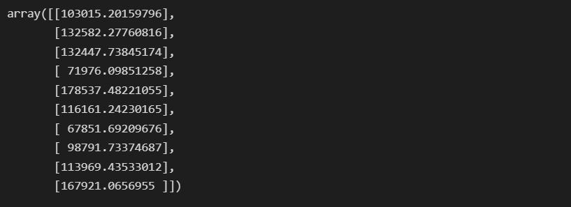

# Check Accuracy of the model

```

score =  model.score(X_test, y_test)*100

print('Accuracy of the model is %.2f percent' %score) 
```


# Plot the Results

## Visualizing the Training set results

```
sns.regplot(x=y_train,y=pred_y,ci=None,color ='red')
plt.scatter(y_train,pred_y, color = 'blue', label = 'sample')
plt.title('Training Set')
plt.xlabel('Actual Values')
plt.ylabel('Predicted Values')
```

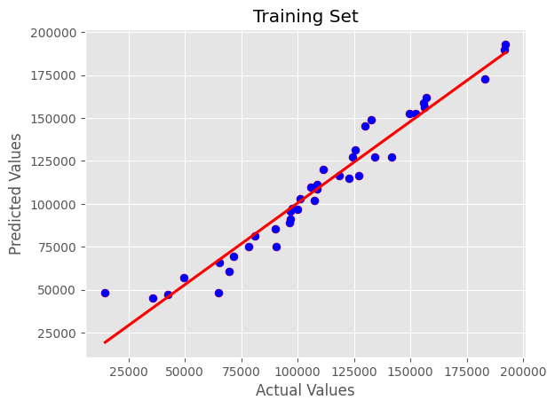

## Visualizing the Test set results

```
sns.regplot(x=y_test,y=y_pred,ci=None,color ='red')
plt.scatter(y_test,y_pred, color = 'blue', label = 'sample')
plt.title('Testing Set')
plt.xlabel('Actual Values')
plt.ylabel('Predicted Values')
```

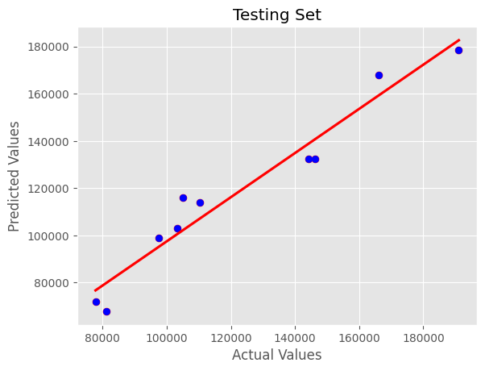

# Conclusion

We have created a new Multiple Linear Regression Model and we learned how to perform One-Hot Encoding for Categerical Values.
